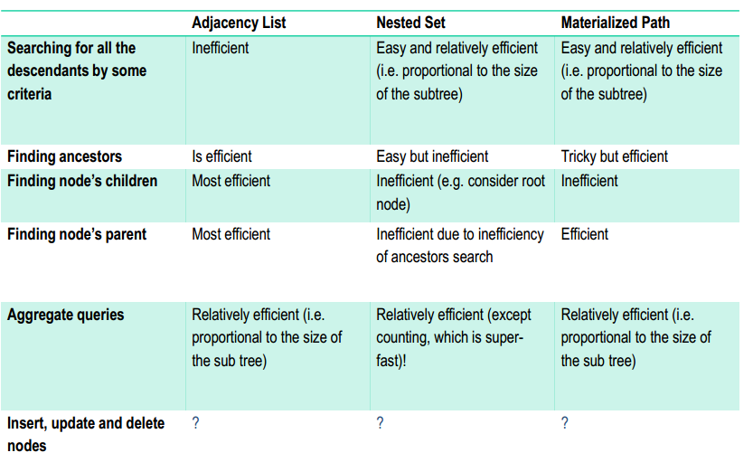

# Datenstrukturen

## Arrays
- In Postgres 1-indexiert!
- Doku: <https://www.postgresql.org/docs/current/static/arrays.html>
```sql
CREATE TABLE sal_emp (
    name text,
    pay_by_quarter integer[],
    schedule text[][]
);
```

```sql
INSERT INTO sal_emp VALUES (
'Bill',
ARRAY[10000, 10000, 10000, 10000],
ARRAY[['meeting', 'lunch'], ['training', 'presentation']]
);
```
### Accessoren
```sql
SELECT ARRAY[1,2,3+4];
-- returns: {1,2,7}
```

### Slicing
```sql
SELECT schedule[1:2]
-- first two elements
```
- `array[from:to]`
- `from` und `to` sind inclusive!

### Operatoren
- Equality mit `=`
- "Is contained by" mit `<@`
```sql
ARRAY[2,7] <@ ARRAY[1,7,4,2,6];
```
- Overlap: `&&`
```sql
SELECT ARRAY[1,4,3] && ARRAY[2,1]
```

## Dictionaries
- Collection aus Key-Value-Pairs, auch "Entitiy Attribute Value" - EAV
- Nur in ausnamefällen in RDBS verwenden!

### hstore in Postgres
!!! note
    TODO!

## Trees
- Adjazenzliste: Jeder Record hat einen Fremdschlüssel zu seinem Parent
- Nested Set-Modell: Die Knoten werden in Preorder-Reihenfolge durchnummeriert. Beim traversieren in die tiefe wird "left" gesetzt, beim backtracking wird "right" gesetzt (immer aufsteigend gezählt)

### Materialized Path (ltree)
- Doku: <https://www.postgresql.org/docs/current/static/ltree.html>
- Knoten auf einer Ebene werden von links nach rechts mit 1,2,3,... nummeriert
- Jeder Knoten hat einen Pfad zu sich von der Root aus gespeichert, in der Form `1.2.1.<...>` ("lineage")
- Im Postgres-Datentyp `ltree` können die Knoten beschriftet werden
    - Dann ist ein Pfad z.B. `top.countries.europe.switzerland`


