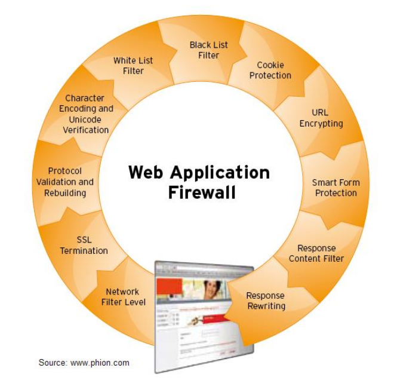

# Web Application Firewall
- Security Requirements für Kreditkarten Processing benötigen WAFs
- Hat meist einen public und authentisierten Bereich
- Leitet Requests entsprechend weiter
- Verwaltet die Sessions mit den Clients und den Applications hinter der WAF
- WAF basiert auf einem Reverse-Proxy

## Pre-Authentication
- Hinter der WAF ist ein "public" Login-Service und eine "private" Web-App
- Die WAF schickt Requests an den Login-Server
- Zwischen Login-Server und WAF / Zwischen WAF und Client gibt es jeweils ein eigenes Cookie
- Die WAF baut mit der Webapp "im Namen des Benutzers" eine Session auf, die vom Login-Server authentisiert wurde

## Airlock WAF
- Kommerzielles Produkt
- Viele der Features lassen sich nachbilden mit FOSS-Software (z.B. mod_security, nginx) 
    - Ausser URL-Encryption und "Form Protection"

## Forensic Readiness
- WAF erzeugt für einen Request eine ID
- Die Request ID wird jeweils an den nächsten Layer / Tier übertragen, aber immer mit ins Log file geschrieben
- So kann später ein Request über mehrere Layers koreliert werden

## Tipps für Übung
- Reverse Proxy schon vorkonfiguriert auf LiveCD
- Zurücksetzen: `/opt/applic/httpd` löschen
    - `hl-apache-kali` reinstallen
- `/etc/init.d/apache_but start`
- `localhost:8888` ist die Application "innerhalb" der WAF
- Alles unter `localhost/private` braucht Authentisierung
- Diagnose-Tool für Header unter `localhost` -> Pre-Auth Demo -> Echo Request Header
- Cookie mit `username=hacker` besteht zwischen private-server und WAF
- In der HTTPD-Config setzt `ProxyPass` den Reverse-Proxy
- `Substitute` ändert z.B. absolute zu relative Links
- Für Glockenshop auch `HTTPS` an reverse-proxy hängen für Login
    - Dazu auch `SSLProxyEngine on` setzen
- Secure-Cookies werden nicht übertragen, weil localhost nicht über TLS läuft
    - Mit `mod_headers` Headers patchen, um `Secure` zu entfernen und Location-Redirects abzuändern
