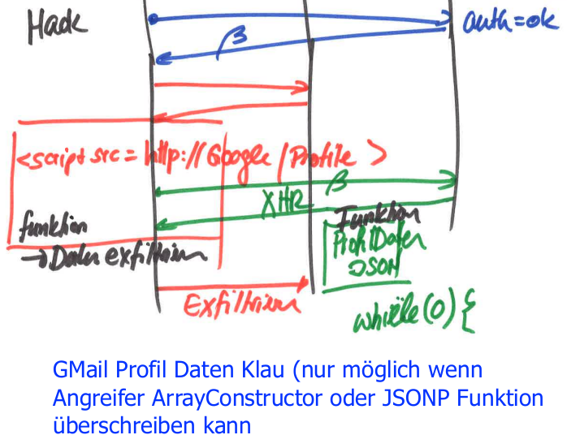

# JSON Hijacking

- Bekannt geworden durch Google
    - Profildaten wurden über AJAX nachgeladen (per JSON und ins DOM eingefügt)
## Szenario
- Opfer ist authentisiert mit Google
- Opfer greift auf Website des Hackers zu
- Darauf ist ein Script von Google eingebunden
    - `<script src="google.com/profile" />` z.B.
- Dadurch schickt Opfer-Browser XHR-Request an Google (mit Access Token)
- Google gibt Daten als JSON zurück
- Im JSON ist ein Array-Konstruktor hinterlegt
- Hacker hat diese Funktion überschrieben, um das JSON zu ihm zu schicken

## JSONP
- "JSON with Padding"
- Der Webserver gibt statt reines JSON ein Javascript Function Call mit dem JSON als Argument mit
- Function Call ist das "Padding"
- Wenn nun ein Request so mit `<script src=".." />` eingebunden wird, führt der Browser das Javascript mit dem JSON drin aus
- Dadurch wird SOP umgangen, ist aber von CORS abgelöst woren

## Voraussetzungen
- Opfer muss authentisiert sein
- JSONP oder allgemein Array-Konstruktor im JSON
    - Keine vertraulichen Inhalte über JSONP übertragen!

## Remediation
- CORS einsetzen, um Zugriff einzuschränken
- Google hat zu Beginn des JSON eine Endlosschleife eingebaut, quick / dirty!
