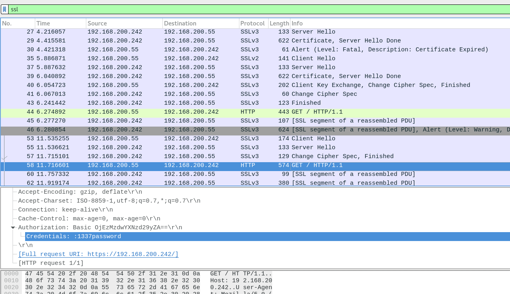

# 7030 Linksys SSL Break
## Vorgehen
- Zertifikat mit littleblackbox (<https://code.google.com/archive/p/littleblackbox/downloads>) finden:
```
./littleblackbox -f 44:59:E1:9D:11:C0:3F:3F:17:FC:15:6F:FA:5C:EA:5A:F2:6C:4F:80 -k
```
- Damit bekommen wir ein Zertifikat, das wir im Wireshark (wie bei 5102) importieren können. Dabei ist es egal, auf welche IP es gesetzt wird (`192.168.200.242` oder `192.168.200.55`)

- Ab dem zweiten GET-Request (wahrscheinlich nach dem Login) wird in jedem Request einen `Authorization` HTTP-Header mitgeschickt (Basic Authentication). Dort können wir User und passwort in der form `user:password` auslesen:



- Der User ist leer, also wird wahrscheinlich nur das Passwort `1337password` benötigt

## Security Questions
#### In this challenge, you have deciphered TLS/SSL traffic; Explain why this is possible!
Der Router, der hier HTTP-Server spielt, braucht ein TLS-Zertifikat um mit den Browsern verschlüsselt zu kommunizieren. Dabei muss der Private-Key des Zertifikats irgendwo auf dem Gerät liegen. Hersteller verwenden oft für alle Geräte das gleiche Zertifikat, damit sie nur ein einziges von einer CA signieren müssen. Wenn nun aber jemand den Private Key auf dem Router findet, könen TLS-Sessions entschlüsselt werden

### Explain mitigation
- Mit "Perfect Forward Secrecy" (Diffie-Hellman) könnten vergangene Sessions nicht mehr entschlüsselt werden. Trotzdem ist das Zertifikat noch kompromitiert, das Problem löst es also nicht.
- Der Private Key des Zertifikats sollte in einem sicheren Hardware-Modul verbaut werden. Das macht es viel schwieriger, den Private Key rauszufinden, es bietet aber noch immer eine Angriffsfläche
- Der Hersteller sollte bei jedem Gerät einmalig ein Zertifikat generieren. Es kann auch self-signed sein, der User muss dann dafür einfach dem Zertifikat einmalig vertrauen
