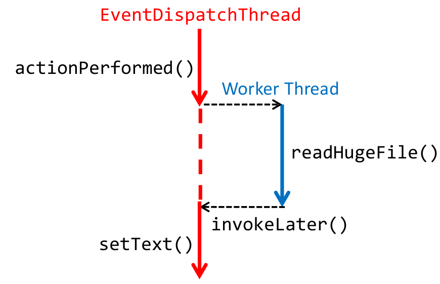
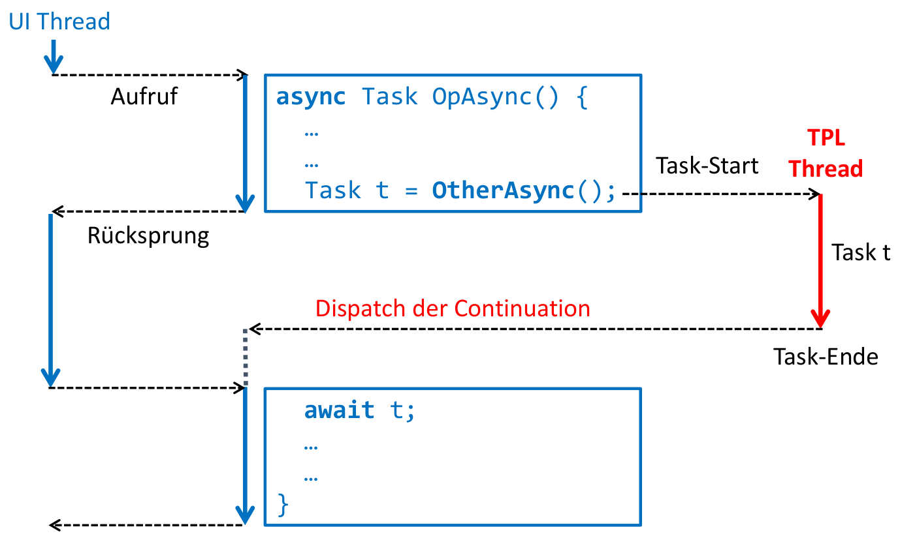

# Summary
## TODO
- Java Synchronisationsprimitiven
    - Lock & Condition
    - Count Down Latch
    - Cyclic Barrier / Phaser / Exchanger
- Unterschied TPL / Java Thread Pool
- Syntax MPI
- CUDA Code-Struktur
- Korrektheit (Wann Data Race, Starvation, etc.)
- Vergleich STM / Reactive / Actor

## Java Monitor
```java
public synchronized void withdraw(int amount)
    throws InterruptedException {
    while (amount > balance) {
        wait();
    }
    balance -= amount;
    }
public synchronized void deposit(int amount) {
    balance += amount;
    notifyAll(); // put all waiting threads in "waiting room"
    // notify() wakes up a random thread
    // -> possible starvation! 
    // still continue execution (signal & continue)
}
```
```java
synchronized(this) {...}
```

## Java Semaphore
```java
this.upperLimit = new Semaphore(capacity, fair);
this.lowerLimit = new Semaphore(0, fair);

public void put(int amount) throws InterruptedException {
	upperLimit.acquire(amount);
	lowerLimit.release(amount);
}

public void get(int amount) throws InterruptedException {
	lowerLimit.acquire(amount);
	upperLimit.release(amount);
}
```

## Java Thread Pool
```java
ForkJoinPool threadPool = new ForkJoinPool();
// non-blocking
Future<Integer> future = threadPool.submit(() -> {
    // function with int return value
    // uncaught exceptions will be ignored!
})
// cancel task
// future.cancel()
// wait until completion (blocking)
int result = future.get()
```
```java
// blocking submit
boolean found = threadPool.invoke(new CountTask());
// CountTask extends RecursiveTask<T>

// Java 8 Standard pool (implicit)
boolean found = new CountTask().invoke();
```
### Completable Futures
```java
CompletableFuture<Long> future =
    CompletableFuture.supplyAsync(() -> longOperation());
// other work
future.get();

// or supply continuation tasks
future.thenAccept(myTask); // without return value
future.thenApply(myTask); // with return value
```
```java
CompletableFuture.allOf(future1, future2)
    .thenAccept(continuation);

CompletableFuture.any(future1, future2)
    .thenAccept(continuation);
```

## Deadlocks
- Für einen Deadlock müssen **alle 4 Voraussetzungen erfüllt sein**
    - **Nested Locks**
    - **Zyklische Warteabhängigkeiten** (Holt-Graph)
    - Gegenseitiger Ausschluss (Locks)
    - Sperren ohne Timeout / Abbruch

## C# Monitor
```csharp
// best practice
private object syncObject = new object();

public void Withdraw(decimal amount) {
    lock(syncObject) {
        while (amount > balance) {
            Monitor.Wait(syncObject);
        }
        balance -= amount;
    }
}
public void Deposit(decimal amount) {
    lock(syncObject) {
        balance += amount;
        Monitor.PulseAll(syncObject); // like notifyAll()
    }
}
```
## C# Task Parallel Library

```csharp
Task<int> task = Task.Run(() => {
    int total = ... // some calculation
    return total;
});
var result = task.Result; // blocking
```
```csharp
// Run parallel tasks and wait for completion (barrier)
Parallel.Invoke(
    () => MergeSort(l, m),
    () => MergeSort(m, r)
);
```
```csharp
// uses Striped Partitioner
Parallel.ForEach(list,
    file => Convert(file)
);
// Uses Range Partitioner
Parallel.For(0, array.Length,
    i => DoComputation(array[i])
);
// waits for all tasks to complete
```
```csharp
// Task Continuation
task1.ContinueWith(task2).ContinueWith(task3);
```
### PLINQ
```csharp
ParallelQuery<Book> query =
    from book in bookCollection.AsParallel()
    where book.Title.Contains("Concurrency")
    select book;
    // no side effects!!
query.ForAll(b => {
    if (Interesting (b)) {
        Read(b);
    }
});
```

## GUI-Programming
### Java



```java
button.addActionListener(event -> {
    // GUI-thread
    new Thread(() -> {
        String text = readHugeFile();
        SwingUtilities.invokeLater(() -> {
            // GUI Thread
            textArea.setText(text);
        });
    }).start();
});
```

!!! warning
    Swing ist nicht thread-safe! Wenn ein anderer Thread auf das UI zugreift, gibt es keine Exception!

### .NET
#### Mit TPL
```csharp
Task.Factory.StartNew(() => {
    int result = LongCalculation(number);
    Dispatcher.BeginInvoke(new ThreadStart(() => {
        resultLabel.Content = result;
    }));
});
```
#### Async / await
```csharp
public async Task<int> LongOperationAsync() { }

Task<int> task = LongOperationAsync();
OtherWork();
int result = await task;
```
- `async`-Methode muss `await` enthalten (gibt Kette)
- Bis zu `await` wird alles synchron, nacher asynchron (beliebiger Thread, ausser wenn Aufrufer UI-Thread ist)



## Memory Models
- Optimizer kann Code-Ablauf nicht-deterministisch ändern, wenn zwei Statements unabhängig voneinander sind ("Weak Consistency")

### Java
- `volatile` ist wie Barriere: Alle änderungen vor dem Zugriff auf `volatile`-Variable werden für andere Threads sichtbar, die auf diese Variable zugreifen

#### Atomic Operations
- Kann mit `getAndSet(newValue)` atomar alten Wert lesen und neuen Wert setzen
- `compareAndSet(boolean expect, newValue)`: Atomares lesen und setzen mit Condition
    - Wenn Variable expected Wert hat, wird neuer Wert gesezt und `true` returned
- Atomic Klassen gibt es auch für Integer, Long und Referenzen
- Java 8: `var.updateAndGet(old -> calculateChanges(old))`

### .NET
#### Volatile Read / Write
- Volatile Read: Bleibt garantiert **vor** den nachfolgenden Zugriffen
- Volatile Write: Bleibt garantiert **nach** den vorherigen Zugriffen
- `Thread.MemoryBarrier()` verhindert Umordnung

## Actor Model
- Actors sind aktiv und kommunizieren asynchron über Channels miteinander
- Actors wissen selbst nichts voneinander, können aber neue Actor kreieren
- Kein shared memory, d.h. Actors können auch auf verschiedenen Nodes laufen
- Synchrones Senden und Empfangen möglich, aber Deadlock/Starvation-Gefahr!

```java
ActorSystem system = ActorSystem.create("System");
ActorRef printer =
    system.actorOf(Props.create(NumberPrinter.class));
for (int i = 0; i < 100; i++) {
    printer.tell(i, ActorRef.noSender());
}
system.shutdown();
```
