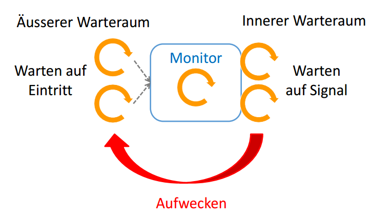

#Thread Synchronisation

!!! note
    `Thread.currentThread().join()` 
    
    Programm wartet ewig, weil es auf die Beendigung von sich selbst wartet


- Synchronisation = Einschränkung der Nebenläufigkeit
- Fälle für Synchronisation
    - Gegenseitiger Ausschluss: Eine Ressource kann nur von jemandem auf einmal benutzt werden
    - Warten auf Bedingung

## Gemeinsame Ressourcen
- Threads können sich gegenseitig stören, weil sie sich Adressraum und Heap teilen
- In Java können lokale Variablen (closure) von Threads nur read-only zugegriffen werden

## Kritische Abschnitte
- Race Condition: Fehler aufgrund von unkontrollierter Nebenläufigkeit
- Race Condition Szenario
    - Beide Threads lesen die aktuelle Balance nacheinander in ein Register
    - Der zweite Thread, der die Balance zurück schreibt, überschreibt den anderen Wert
    - -> Lost Update
- Ein Programmstück, dass eine Race Condition verursachen könnte, ist eine "Critical Section"
- Naiver Ansatz: "Locked"-Boolean einführen und evtl. warten, bis `locked == false` ist
    - Problem: Prüfung des boolean und Zuweisung nicht atomar -> Gleiches Problem wie vorher

## Gegenseitiger Ausschluss
- Eigene Implementierung nicht trivial (gibt spezielle Algorithmen)
- Weitere Probleme mit CPU-Optimierungen, Reihenfolge der Instruktionen ist nicht garantiert
- Busy-Waiting (Endlosschleife) ist ineffizient

## Java Monitor Konzept
```java
public synchronized void deposit(int amount) {
    this.balance += amount; // Kritischer Abschnitt
}
```
- Body der Funktion wird unter gegenseitigem Ausschluss ausgeführt
- Nur ein Thread auf einmal kann die Methode ausführen
- Bei jedem Eintritt wird das Objekt gelockt (Monitor-Lock)
- Gilt für das ganze Objekt, auch andere synchronized-Methoden schliessen sich gegenseitig aus

- Freigabe des Locks bei Ende, return oder unhandled Exception

- Recursive Locks: `synchronized` Method ruft andere `synchronized` Method auf (nested Lock)
    - Ist in Java kein Problem, in anderen Sprachen u.U. schon

#### Synchronized Statements
- `synchronized(object) { statements }`
- `object` bezieht sich auf das Objekt, das gelockt wird
- Bei `synchronized` mit Static-Klassen wird `<class>.class` mitgegeben, dann wird die Klasse gelockt (Singleton)

### Warten auf Bedingung
- Naiver Ansatz: in Schleife warten, bis Bedingung erfüllt
    - Funktioniert nicht: Lock wird nicht aufgelöst, es kann niemand anders das Objekt bearbeiten
    - Ineffizent, immer zu pollen

## Wait & Signal
- Monitor: Gegenseitiger Ausschluss + Wait & Signal Mechanismus
- Nur ein Thread kann "im Monitor" sein
- Spezieller Wartebereich für Threads, die auf eine Bedingung warten
- Sie werden signalisiert, sobald die Bedingung erfüllt ist

```java
class BankAccount {
    private int balance = 0;
    public synchronized void withdraw(int amount)
        throws InterruptedException {
        while (amount > balance) {
            wait();
        }
        balance -= amount;
        }
    public synchronized void deposit(int amount) {
        balance += amount;
        notifyAll();
    }
}
```
- `wait()` setzt den Thread in die Warteschlange zum Warten auf eine Bedingung
- `notifyAll()` weckt alle im Monitor wartenden Thread auf
    - Behält aber den Monitor-Lock für weitere Instruktionen ("Single and Continue")
- Ein aufgeweckter Thread geht wieder in den "äusseren" Warteraum, genau wie alle anderen eintrittswilligen Threads



- Wieso funktioniert das?
    - `wait()` setzt sich in den "Warteraum" und gibt den Monitor (den Lock auf das Objekt) frei
- `notify()` weckt einen *beliebigen* Thread im "Warteraum" auf
- Die Reihenfolge im "Warteraum" ist in Java nicht spezifiziert (in .NET FIFO)
- Spurious Wakeup: Ein wartender Thread kann "fälschlicherweise" aufgeweckt werden, ohne dass `notify` aufgerufen wurde
    - Problem von POSIX-Threads
- 
## Fallstricke beim Java Monitor
### Wait mit If
- Nach dem `wait()` muss die Bedingung wieder überprüft werden
    - In der Zwischenzeit könnte nach dem `notify()` und vor dem Eintreten die Bedingung wieder invalidiert werden
    - Daher: `while (!conditioin) { wait(); }`
### Single-Notify
- `notify()` weckt ein beliebiger einzelner Thread auf
- Wenn immer ein falscher Thread aufgeweckt wird, terminiert das Programm nie
- Lösung: `notifyAll()` verwenden

## Effizenz-Probleme
- `notifyAll()` weckt alle auf, bei vielen Threads ist das viel Overhead für die Überprüfung der Bedingung
- Keine Fairness: Keine Warteschlange spezifiziert
- Signal-and-Continue: Informierte muss neu anstehen und können ständig überholt werden
    - Auch bei FIFO (.NET) nicht garantiert fair
