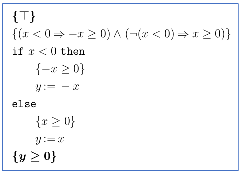
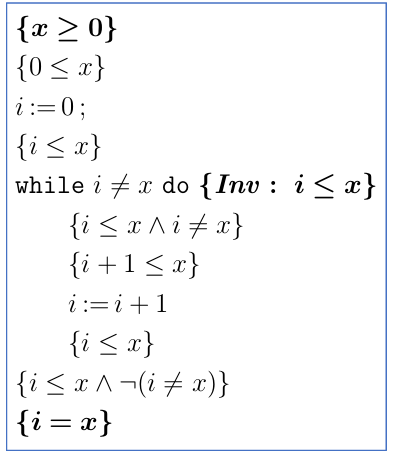

# Proving Programs Correct

- Bis jetzt: Unit testing, um Korrektheit zu prüfen
- Kann nicht alle Bugs finden: Wie weiss man, welche Tests "gut genug" sind?
- Ziel: Programm wie eine mathematische Formel formell beweisen
- Scope dieser Vorlesung: Imperative single-thread Programme
- Ansatz in Dafny: "Desing-by-Contract", man definiert Post-conditions, die vom Compiler überprüft werden

## Hoare Triples
- \({P} C {Q}\)
- \(P\) ist Precondition, \(C\) Programm / Command, \(Q\) ist Postcondition
- Correctness-Aussage: Wenn \(P\) erfüllt ist, wird durch \(C\) die Postcondition \(Q\) erfüllt
- Diese Aussage ist selbst ein "boolean" (Predicate): Kann wahr oder falsch sein

## Inference Rules
- \([x := E]\) -> \(x\) wird durch \(E\) ersetzt

## Automatisierung
- Allgemeiner Fall ist unentscheidbar
- Einfache logiken können aber meist automatisch bewiesen werden
- Workflow: Aus \(P C Q\) Verification Conditions erstellen, die dann bewiesen werden (oder nicht)

## Proof mit If und While
### If
- Wieder von unten nach oben, aber Verzweigung beachten
- Vorbedingung über ganzes `if`: Entweder ist es true, dann hat man eine Vorbedingung, oder es ist falsch, dann die andere Vorbedingung
- Mit If-Bedingung P: \((P => \text{Vorb. true}) \land (\lnot P => \text{Vorb. else})\)

### While
- Keine 100%-ige Lösung (Turing-Completeness - nicht entscheidbar)
- Loop-Invariant: Eigenschaft, die sowohl zu Beginn als auch zum Ende des Loops wahr sein muss (nicht veränderbar)
- Schwierigkeit: Loop Invariant finden
- Vorgehen
    - Loop Invariant \(I\) annehmen
    - Vorbedingung des Loop-Bodies ist \(I \land P\) mit \(P\) = Loop-Condition
    - Mit \(I\) das Hoar-Triple im `while` beweisen (mit \(P = I\) und \(Q=I\))
    - Wenn dieser Beweis geht, ist die Invariante korrekt
    - I als Vor- und Nachbedingung des Loops nehmen
        - Nachbedingung erfüllt Loop-Condition *nicht* (AND verknüpfen): \(I \land \lnot B\)
        - while-loop ist jetzt "subroutine", die bewiesen ist
    - nachbedingung => Q beweisen
    - Vorbedingungen vor der Schleife wie gewöhnlich nach oben beweisen
    - Verification Conditions
        - \(P \Rightarrow \text{result pre-while}\)
        - \(I \land B \Rightarrow \text{result while-body}\)
        - \(I \land \lnot B \Rightarrow Q\)
- Loop Invariant **für Prüfung vorgegeben!**

## Dafny
- Neben formaler Korrektheit wie hier besprochen wird auch Terminierung überprüft
    - z.B., ob in while counter hinuntergezählt wird, dass die Schleife terminiert wird
