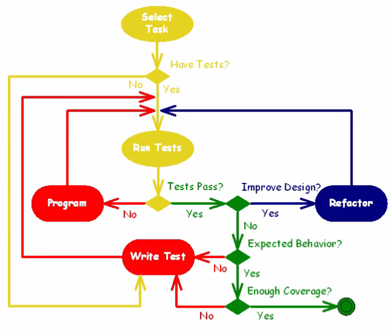

# Test-Driven Development

## TDD Cycle

- **RED**: Make a failing microtest for the change
- **GREEN**: Make the change pass the test
- **Refactor**: Make the design excellent (test and code!)
- **Integrate**: Make the test and the change permanent
- Back to RED!

## RED
- Write a microtest that *fails*
- New functions and classes can have placeholder code, such that the test still compiles

### Writing a test
- Write an `assert` statement 
- Generate all necessary code to make the test compile
- Write the dumbest, most simplistic solution (= test passes) first, then break it with a test

## GREEN
- Make the test pass with simple code
- Refactor later
- The code *only* covers the functionality that the test covers
- All *existing* tests must still pass

## Refactor
- Refactor *continuously* and *mercilessly*
- Refactor both *test* and *production* code

## Integrate
- Check in your code, even small steps!
- Often avoids merge conflicts
