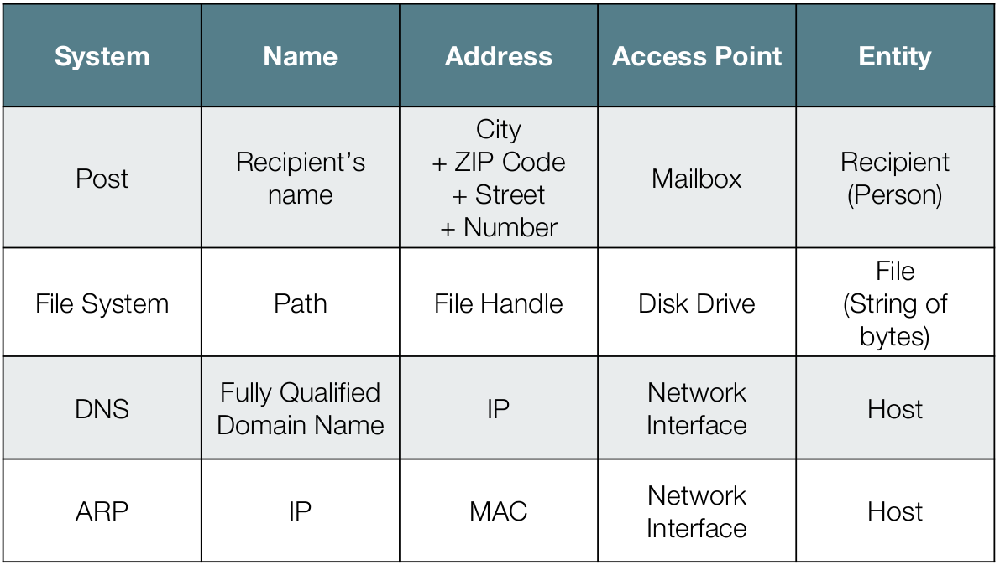

# Exam
Grobe Aufteilung der beiden Prüfungsteile: 75 Punkte SLM, 45 -Punkte MFA = 120 Punkte total

- Teil 1 (MeF):
    - Die Fragen werden auf English gestellt. Antworten auf Englisch & Deutsch möglich.
- Teil 2 (SLM): 
    - Fragen werden auf Deutsch gestellt.
- Erlaubte Unterlagen: 
    - 1 A4 Zusammenfassung (Beidseitig) für die Gesamtprüfung. Andere Kombinationen (z.B. 2 A4 Blätter einseitig, 2 A5 Blätter beidseitig, usw.) nicht erlaubt. Die Zusammenfassung darf keine Lösungen zu Übungsaufgaben und Prüfungsaufgaben beinhalten. Sonst "Closed Book".

## VSS Architectural Styles

## Fowlers Fallacies
- The network is reliable.
- Latency is zero.
- Bandwidth is infinite.
- The network is secure.
- Topology doesn't change.
- There is one administrator.
- Transport cost is zero.
- The network is homogeneous.

## Sockets

## Messaging Patterns
- **Basic Pattern**: Analog zu einem Brief, der von einem Message Endpoint zum anderen gesendet wird
- **Blocking Receiver Message Pattern**: Synchrone Übertragung, Server und Client warten auf die Antwort
- **Polling Receiver Message Pattern**: Der Receiver macht Anfragen zum Empfangen der Nachricht (Polling)
- **Service Activator Message Pattern**: Auf einen Request ruft der "Replier" mit dem "Service Activator" die richtige Service-Funktion auf (RPC-style)

## Message Reliability Levels

- Best effort nonpersistent
    - Messages are discarded when a messaging engine stops or fails. Messages might also be discarded if a connection used to send them becomes unavailable or as a result of constrained system resources. 
- Express nonpersistent
    - Messages are discarded when a messaging engine stops or fails. Messages might also be discarded if a connection used to send them becomes unavailable. 
- Reliable nonpersistent
    - Messages are discarded when a messaging engine stops or fails. 
- Reliable persistent
    - Messages might be discarded when a messaging engine fails. 
- Assured persistent
- Messages are not discarded. 

## Enterprise Integration Patterns

### Point-to-Point Messaging Pattern
- Simpelste Form, ein Sender schickt einem Receiver über einen beliebigen Channel eine Message
- Meist wird eine *Message Expiration* gesetzt. Ist diese abgelaufen, wenn der Receiver die Message erhält, wird sie verworfen oder an einen "Dead Letter Channel" geschickt
- *Command Message Pattern*: Message, die dem Receiver mitteilt, etwas auszuführen
- *Document Message Pattern*: Reine Daten-Übertragung
 
## Public-Subscribe Pattern
- Der Publisher (Sender) schickt die Messages an einen *Publish-Subscribe-Channel*
- Der Channel schickt eine Kopie der Message an einen Output Channel
- Jeder Output-Channel hat genau 1 Subscriber
- Jeder Subscriber erhält die Nachricht 1 Mal

- *Topic-based*: Subscriber melden sich an verschiedenen "topics" an (logische Channels) und erhalten nur die Nachrichten, die zu diesen Topics geschickt werden
- *Content-based*: Der Subscriber definiert Eigenschaften der Messages, die er bekommen möchte. Er erhält dann nur die Nachrichten, die dem entspechen

- Meistens gibt es zwischen Publisher und Subscriber einen Message Broker, der die Messages entgegennimmt und Subscribers verwaltet

### Receiving Message Endpoint Pattern
- *Competing Customers*: Mehrere Receiver verarbeiten messages gleichzeitig
- *Selective Customer*: Der Receiver entscheided beim Ankommen der Message anhand von Kriterien, ob die Message verarbeitet werden soll

## RPC

## Begriffe
- *Mean Time to Recover (MTTR)*: Durschnittliche Zeit zwischen dem Ausfall und der Wiederaufnahme
- *Mean Time to Failure (MTTF)*: Durchschnittliche Zeit zwischen zwei Ausfällen ohne Recovery Time, also vom Zeitpunkt der Recovery bis zum nächsten Ausfall
- *Mean Time between Failure (MTBF)*: Durchschnittliche Zeit zwischen zweil Ausfällen, *recovery time eingerechnet*. (MTTF + MTTR)
- *Recovery Time Objective (RTO)*: Zeit, in der das System wiederhergestellt werden *muss* (NFR-Requirement)
- *Recovery Point Objective (RPO)*: Maximal tolerierbare Zeitspanne, in der Daten nach einem Ausfall verloren sein könnten (NFR-Requirement)
- *Warm Backup*: Zwei Server laufen parallel mit einem als Master und der andere passiv
- *Hot Backup*: Master- und Backup-Server arbeiten parallel, Backup muss immer den gleichen Stand haben wie Master (synchronisiert)

## Availability

- Serielle, abhängige Komponenten: \(A = A_1 \cdot A_2 \cdot A_3\)
- Parallele Komponenten: \(1 - [ (1 - A_1) \cdot (1 - A_2) \cdot (1 - A_3) ]\)

## System Management Patterns
- **Wire-Tap**: Einen Message-Channel "abhören", indem die Messages neben dem Ziel auch an einen zweiten Channel zur Inspektion gesendet werden
- **Detour**: Nicht alle Messages werden direkt ans Ziel gesendet, sondern an eine Zwischenstelle, die Validierung, Debugging o.ä. vornimmt. Ein Router entscheidet, welche Messages über diese "Detour" und welche direkt an das Ziel gesendet werden
- **Test Message**: Eine Art Black-Box-Test, in dem Test Messages ins System gefüttert werden, und hinterher geschaut, welche Messages raus kommen. So können interne Verarbeitungs-Fehler erkannt werden
- **Smart Proxy**: Analog zu einem Web-Proxy: Er ändert die Returnadresse zu sich selbst, und leitet die Antwort schliesslich zum originalen Absender wieder (Message-"Intercept")
- **Message Store**: Für jede Message wird jeweils eine Kopie an einen zentralen Message Store gesendet
- **Message History**: Die Message trägt eine History auf sich (im Header), von welchen Applikationen sie bereits vearbeitet wurde. Dies erleichtert debugging, da man den Weg der Message verfolgen kann.
- **Channel Purger**: Ein Filter, der gewisse "verbliebene" oder fehlerhafte Messages verwirft, damit das System wieder in einen konsistenten Zustand versetzt wird.

## CFIA-Matrix
- "Configuration Items" in vertikale Spalte (OS, Server, Datenbank, Middleware, Prozesse, Disks, etc.)
- Kritische Servives in horizontale Spalte
- Ausfälle von CIs bewerten
- `X`: Service nicht mehr verfügbar, `A`: Alternatives CI bietet den Dienst, `M`: Alternatives CI, aber manueller Eingriff nötig

## Naming Terminology
- *Name*: String to identify an entity
- *Entity*: Physical or logical object
- *Access Point*: Entity that is used to access another entity
    - Often given through physical connection, e.g. a customers owns his phone
- *Address*: Name of an Access Point
    - often defined at another level, e.g. a MAC-Adress to a NIC

