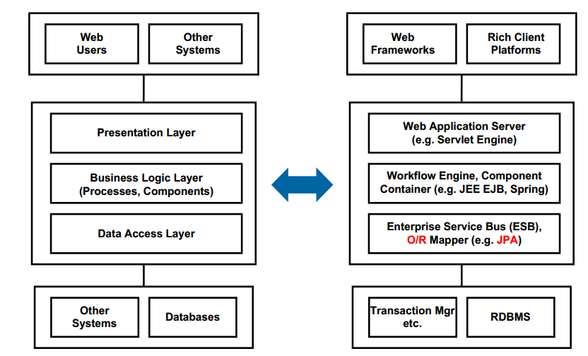
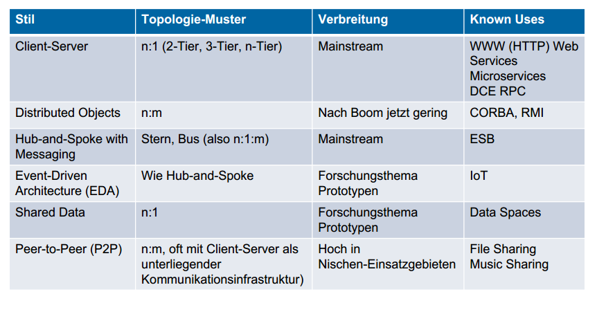

# Introduction

- Transparency Types: Eigenschaften eines Systems transparent (= "durchsichtig") für den Benutzer machen, damit er nicht mitbekommt, dass z.B. mehrere Benutzer gleichzeitig zugreifen (Concurrency Transparency)
- Vorteile von VSS
    - Bilden die verteilte Realität ab (verschiedene Arbeitsplätze etc.)
    - Performancesteigerung (paralelle Verarbeitung)
    - Skalierbarkeit
    - Fehlertoleranz
- Herausforderungen VSS
    - Komplexe Kommunikation
    - Performanceprobleme (Latenz, Durchsatz)
    - Zuverlässigkeit (Netzzugriffe, Ausfälle)
    - Transaktionssicherheit (mehrere Benutzer)
    
## Middleware
**Midleware** ist infrastrukturelle Software, die eine Ebene unter dem Software-System liegt

- Wird i.d.R. nicht selbst geschrieben
- Dient zur Kommunikation zwischen den Software-Komponenten
### Kommunikationsmiddleware
- Interfaces zur Netzwerkprogrammierung
- TCP/IP Sockets, RESTful HTTP, etc.
### Anwedungsorientierte Middleware
- High-level Protokolle
- Unterstützung verteiler Andwendungen
- Vereinfacht das Design der Applikation
- bietet Sicherheit, Zuverlässigkeit, verteilte Transaktionen, ...
- z.B. .NET Application Server, SQL mit Remote Queries, ...

## VSS Architectural Styles

- *Hub and Spoke*: Alle kommunizieren über zentrale Stelle ("Hub")

- CORBA (Centralized Object Request Broker Architecture) wird heute nicht mehr verwendet, die Prinzipien sind aber immer noch releveant

## Idempotenz
- Idempotente Funktion: z.B. zwei Zahlen addieren, Funktion macht bei jedem gleichen Aufruf das selbe
- Nicht-idempotente Funktion: Es wird ein Zustand verändert, bei zweitem gleichen Aufruf ist das Verhalten anders. z.B. Lagerstand ändern, Konto-Übertrag
- Server idempotent machen: Designfrage, z.B. jede Nachricht mit eindeutiger ID versehen, Server darf diese ID nur einmal bearbeiten
