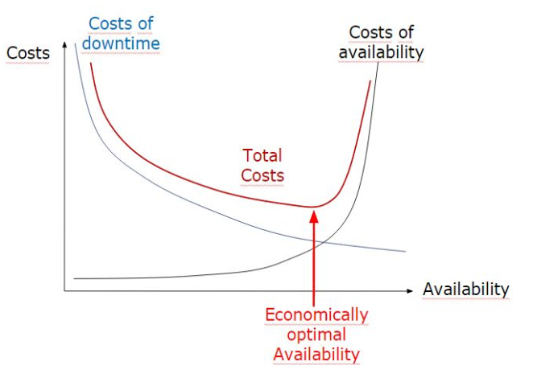

# Design for Scalability & Availability

## Scalability
- Ziel: Skalierung soll linear sein
    - Workload ist linear proportional zu den vorhandenen Ressourcen
- In Grösse Skalieren: Schnellere oder mehr Hardware-Komponenten
- Generation Scalability: Schnellere / Bessere HW-Komponenten durch technische Innovation
- *Vertikal* skalieren: Performance / Kapazität der Server erhöhen
- *Horizontal* skalieren (Scale out): Anzahl Server / Nodes erhöhen
    - z.B. mit Load-Balancer verteilen
    - *Session Affinity*: Alle requests einer Session werden vom Load-Balancer an den gleichen App-Server geschickt
        - Wird mit Session-Cookie realisiert

## Availability
### Ursachen von Fehlern
- Architektur (Systems Architecture) / Umwelt
    - Kommunikationskanäle
    - Strom
    - Höhere Gewalt
- System-Management
    - Auch die besten Mitarbeiter machen Fehler
        - Möglichst automatisieren
        - Redundanz
        - Schulung
    - Software-Installation
- "Transient Software Errors"
    - Fehler, die nicht immer reproduzierbar sind
    - Anderes Verhalten beim Debuggen
    - Race Conditions

## Definition
- Ein System ist "available", wenn es läuft *und* korrekte Resultate erzeugt, und evtl. weitere NFS wie Response Time erfüllt
- Availability ist der Anteil der Zeit, in der das System verfügbar ist (0 - 1)

## Begriffe
- *Mean Time to Recover (MTTR)*: Durschnittliche Zeit zwischen dem Ausfall und der Wiederaufnahme
- *Mean Time to Failure (MTTF)*: Durchschnittliche Zeit zwischen zwei Ausfällen ohne Recovery Time, also vom Zeitpunkt der Recovery bis zum nächsten Ausfall
- *Mean Time between Failure (MTBF)*: Durchschnittliche Zeit zwischen zweil Ausfällen, *recovery time eingerechnet*. (MTTF + MTTR)

- *Recovery Time Objective (RTO)*: Zeit, in der das System wiederhergestellt werden *muss* (NFR-Requirement)
- *Recovery Point Objective (RPO)*: Maximal tolerierbare Zeitspanne, in der Daten nach einem Ausfall verloren sein könnten (NFR-Requirement)

## Kosten
- Kosten wachsen nach 95% 1Availability sehr schnell, 100% ist fast unmöglich
- Gesucht wird das Minimum der Funktion `Cost of Downtime + Costs of Availability`

- Wenn Komponenten voneinander abhängen, wird die Verfügbarkeit der einzelnen multipliziert -> Die totale Verfügbarkeit ist kleiner als die der schwächsten Komponente
- Bei Parallelen Komponenten ist die totale Verfügbarkeit \( 1 - [ (1 - A1) * (1 - A2) * (1 - A3) ]\)
    - Die gesamte Verfügbarkeit ist höher als die der einzelnen Komponenten

## Techniken zur Verbesserung der Verfügbarkeit
### Single Point of Failures vermeiden
- Sind oft selten gebrauchte Komponenten
- Login-Server (z.B. Active Directory)
- Kann auf Hardware- oder Software-Seite sein

### Redundanz
- Clusters
- Warm Backups
    - Zwei Server laufen parallel mit einem als Master und der andere passiv
    - Bei einem Ausfall übernimmt der zweite, passive, Server (Fail-over)
- Hot Backup
    - Master- und Backup-Server arbeiten parallel, Backup muss immer den gleichen Stand haben wie Master (synchronisiert)
    - Ist teuer, da praktisch die doppelte Anzahl Resourcen gebraucht werden
    - Wird z.B. im Aktiengeschäft eingesetzt

Design Option | Installed Nodes | Running Nodes | Active Nodes
--------------|-----------------|---------------|-------------
Cold Standby  | N               | 1             | 1
Warm Standby  | N               | N             | 1
Hot Standby   | N               | N             | N

### Ausfälle so schnell wie möglich entdecken
- Je kleiner das Auftreten des Fehlers zum Erkennen ist, desto kleiner wird die MTTR
- Fail fast
    - Fehler sofort melden, wenn es zu Ausfall kommen könnte
    - System regelmässig prüfen, um Fehler früh zu erkennen
