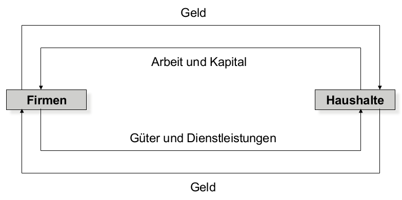
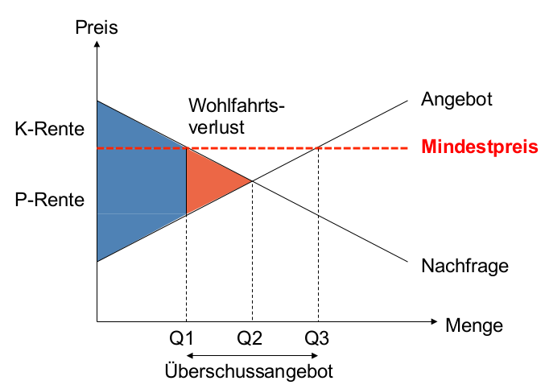

# Markt und Preise

## Axiome der Volkswirtschaft
- Unbeschränkte Bedürfnisse stehen begrenzen Ressourcen gegenüber
- Heisst: Man muss ständig entscheiden, was man mit den Ressourcen anstellt
- *Opportunitätskosten*: Kosten, die anfallen, weil man nicht die alternative wählt, die Kosten des Verzichts der Alternative
    - Bestimmt Preis: Opportunitätskosten bei einem Kauf ist der Preis (alternative wäre Verzicht auf Konsum)

- *Planwirtschaft*: Ressourcen gehören dem Staat, der dessen Einsatz lenkt
- *Marktwirtschaft*: Markt regelt die Preise durch Angebot / Nachfrage

## Mikroöknomisches Grundmodell
- Annahmen (unrealistisch)
    - Nur ein Gut wird betrachtet (genau gleiche Eigenschaften), dass von allen Konkurrenten genau gleich hergestellt wird. Nur der Preis ist unterschiedlich.
    - Grosse Anzahl von Anbietern und Nachfrager
    - Keine Monopole, Transportkosten, etc.
    - Alle sind über Mengen und Preise vollständig informiert
- Modell ist also sehr stark vereinfacht
- *Konsumentenrente*: Differenz zwischen Zahlungsbereitschaft (würden Konsumenten den Preis nicht kennen) und effektiver Preis (rente = "geschenk")
- *Produzentenrente*: Gleiches Prinzip für Produzenten, sie würden das Gut für weniger anbieten, als es nötig ist
- *Wohlfahrt*: Gesamtrente. Diese soll maximiert werden

### Preiseingriffe

- Mindestpreis: Konsumentenrente sinkt, Produzentenrente steigt, Anfrage sinkt, Angebot steigt
    - Insgesamt ist Wohlfahrt gesunken
- Genau gleich, aber umgekehrt beim Höchstpreis
    - Problem in Venezuela, es gibt ein Nachfrageüberschuss
- Auch "Slope" der Kurve ist relevant
- Unelastische Nachfrage: Steile Nachfrage-Kurve, z.B. Medikamente
    - Wenn es wenig Alternativen gibt, oder das Gut lebensnotwendig ist
- Elastische Nachfrage: Flache Nachfrage-Kurve, Preise ändern sich schnell, z.B. Luxusprodukte
- *Preiselastizität des Angebots*: Veränderung der angebotenen Menge / Veränderung des Preises
    - unealstisch, wenn gut weniger haltbar ist
- *Einkommenselastizität*: Veränderung der Nachfrage / Veränderung des Einkommens
    - Kann auch negativ sein für Güter - je mehr man verdient, desto weniger davon konsumiert man

## Beitrag des Staates
- Nach Theorie schadet Eingriff des Staates
- Staat braucht aber trotzdem Eingriffe
    - Rechtssystem für Eigentum- und Vertragsrechte
    - Marktversagen korrigieren: z.B. Monopole verhindern (Wettbewerbsrecht)
    - Ausgestaltung gewünschter Regulierungen
