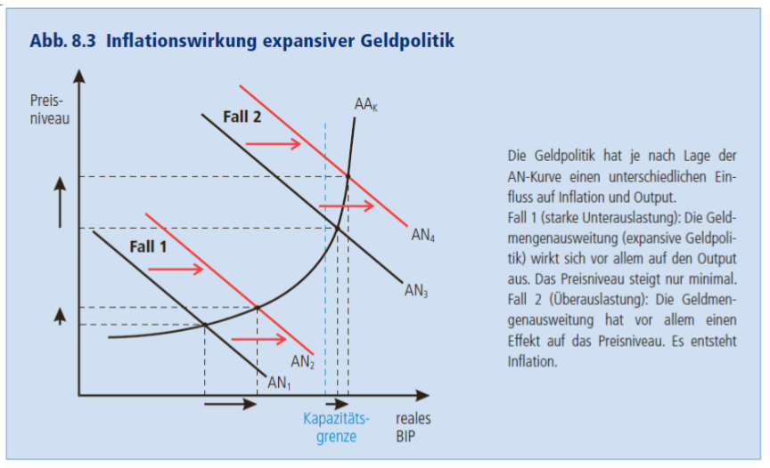
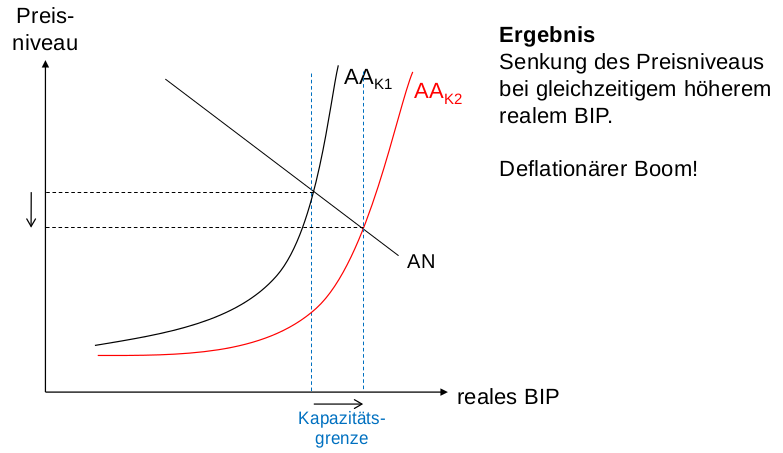
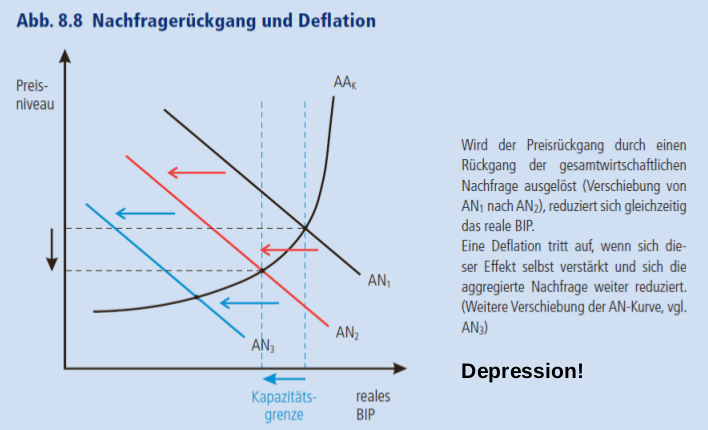

# Preisstabilität

## Inflation
- Bei extremer Inflation geht Währung "kaputt"
- Heute ist Venezuela am nähesten daran
- In der Schweiz seit 20 Jahren nicht relevant
- Dafür gibt es jetzt in der Schweiz Deflation

## Entstehung
- *Permanente* Steigerung des Preisniveau
    - Nicht Schwankungen des Preisniveaus!
- Auslöser ist einmalige Steigerung des Preisniveaus
    - expansiver Nachfrageschock oder negativen Angebotsschock
- Hängt auch von der Geldpolitik der Zentralbank ab (Geld drucken)

### Expansiver Nachfrageschock
- Nachfrage geht nach rechts
- Preisniveau erhöht sich (noch keine Inflation, evtl. Beginn)
- -> *Nachfrageorientierte Inflation*

### Negativer Angebotsschock
- Angebots-Kurve geht nach links
- Preisniveau steigt

### Lohn-Preis-Spirale
- Durch erhöhtes Preisniveau nimmt Kaufkraft ab
- Haushalte wollen Lohnerhöhung ("auf Vorrat" - überkompensation)
- Höhere Produktionskosten der Unternehmen
- Dadurch höhere Preise ("wieder auf Vorrat")
- Preisniveau steigt weiter, usw..

- Verursacht durch Überkompensation der Inflation
- Inflation geht nur, wenn dann Zentralbank Geld druckt
    - Inflation hilft dem Staat, weil Schulden dadurch (real) kleiner
    - "Bezahlt" durch Kreditgeber des Staates (meist das eigene Volk z.B. durch Staatsanleihen) oder z.B. Pensionskasse

### Quantitätsgleichung
- \(P x Q = M x V\)
- V ergibt sich aus den Anderen Variablen
- P = Preisniveau
- Q = reales BIP
- M = Geldmenge ingesamt in der Schweiz
- P x Q = Nominales BIP
- V = Geldumlaufgeschwindigkeit \(\frac{P x Q}{M}\)
    - Mit einer Note werden im Jahr mehrere Zahlungen gemacht
    - Noten: >> 1
    - Sparkonten: < 1
    - In der Schweiz ca. 0.18 sinkend
- Wenn Geldmenge grösser wird, muss bei gleichem BIP das Preisniveau steigen
- In der Schweiz ist M gestiegen, P und Q etwa gleich geblieben
    - Also muss Geldumlaufmenge gesunken sein -> Mehr gespart
    - Viel Geld liegt bei den Geschäftsbanken
        - Wenig Nachfrage nach Krediten bei Banken, grosse Unternehmen haben hohe Liquidität

- USA hat als Ausgleich Zinsen erhöht, um Wachstum zu bremsen
    - Dadurch investieren Unternehmen weniger und Haushalte sparen mehr

### Erhöhung der Geldmenge
- Nachfrage-Kurve verschiebt sich nach rechts
    - Zinsen sinken -> Haushalte geben mehr aus
- Auswirkung: Preisniveau und BIP steigt
    - BIP-Steigerung überwiegt Erhöhung des Preisniveaus, wenn in einer Depression
- In einer Boom-Phase ist die gleiche Erhöhung des Angebots schädlicher, weil das BIP weniger steigt als das Preisniveau
- Das ist das Problem am Euro: Erhöhung der Geldmenge hat je nach Konjuktur-Lage einen negativen (DE) oder positiven (Griechenland) Einfluss

### Kosten der Inflation
- Zinsen werden in Inflationszeiten eher zu hoch angesetzt aus Unsicherheit
- Preise werden verzerrt, weil verschiedene Güter unterschiedlich schnell teurer werden, Preisgefühl geht verloren

### Bekämpfung der Inflation
- Nachfrage runterdrücken durch restriktive Geldpolitik
- Preis: Niedrigeres BIP, mehr Arbeitslosigkeit

## Deflation

- Deflationäler Boom ist keine Deflation - Positiv!

- Permanenter Rückgang des Preisniveaus
- Kann Angebotsorientiert werden: Angebot steigt
- Oder Nachfrageorientiert: Nachfrage sinkt (weniger konsumiert)

- "Depressionsfalle" wie in Japan
    - Preise sinken, Haushalte sparen
    - Immer weniger Bevölkerung (Alterung)
    - Ist abgeschlossen (keine Immigration)
- Deflationserwartung ist selbsterfüllend
- Nominallöhne bleiben gleich, wird für Unternehmen teurer
- Staat gibt mehr aus als Gegenmittel, führt aber zu hohen Staatsschulden
